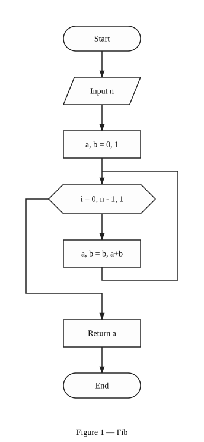
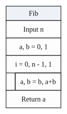

<h1 align="center">Hi there 👋, I'm Oleksii Odarchuk</h1>
<h3 align="center">aka iShawyha | Backend Developer (Go) from Ukraine 🇺🇦</h3>

<p align="center">
  
</p>

<p align="center">
  <a href="https://ishawyha.dev"></a>
  <a href="https://rombik.app"></a>
</p>

---

### 👨‍💻 About Me

- 
- 
- 💼 Backend Developer (Go) at **SkyService** — Go microservices, an AI orchestrator and a RAG platform in production
- 🧑‍🎓 Student at [Taras Shevchenko National University of Kyiv](https://knu.ua/), Faculty of Information Technology
- 🔷 Creator of [**rombik**](https://rombik.app) — code in 10 languages → a DSTU 19.701-90 flowchart
- 🐍 Author of [**Piton**](https://piton.ishawyha.dev) — a Ukrainian programming language with its own interpreter
- 🏆 1st place at BEST Hackathon 2026 · 3rd at Mate Hackathon 2026 · personally invited to DOU Day 2026
- 🐧 Daily Linux user (`I use Arch btw`)
- 💃 Ukrainian folk dancer, and I write for the theatre

---

### 🚀 What I'm Building

Feed [**rombik**](https://rombik.app) a function in any of 10 languages:

```go
func Fib(n int) int {
	a, b := 0, 1
	for i := 0; i < n; i++ {
		a, b = b, a+b
	}
	return a
}
```

…and get back a flowchart or a structogram, drawn to the standard — the images below came straight out of `rombik render`:

<p align="center">
  
  &nbsp;&nbsp;&nbsp;&nbsp;&nbsp;&nbsp;
  
</p>
<p align="center"><sub>flowchart · ДСТУ 19.701-90&nbsp;&nbsp;&nbsp;&nbsp;&nbsp;&nbsp;&nbsp;&nbsp;structogram · Nassi–Shneiderman</sub></p>

| Project | What it is | Stack |
|---|---|---|
| 🔷 [**rombik**](https://rombik.app)<br> | Commercial micro-SaaS. A compiler pipeline (parser → IR → layout → render) on tree-sitter turns code in **10 languages** into flowcharts and Nassi–Shneiderman structograms, pixel-for-pixel to DSTU 19.701-90 / ISO 5807. Web editor, 8 export formats, public API, CLI and an MCP server. | `Go` `Gin` `tree-sitter` `PostgreSQL` |
| 🐍 [**Piton**](https://github.com/OlexiyOdarchuk/piton)<br>  | My own programming language — Ukrainian transliterated syntax, written from scratch in Go without yacc/bison: recursive-descent parser, tree-walking evaluator, Turing-complete. Compiled to **WebAssembly via TinyGo** (~220 KB) — [try it in the browser](https://piton.ishawyha.dev). | `Go` `TinyGo` `WebAssembly` `D2` |
| 🏦 [**go-monobank-sdk**](https://github.com/OlexiyOdarchuk/go-monobank-sdk)<br>  | Go SDK covering **all five public monobank APIs** — personal, corporate, business, acquiring and installment purchases. ECDSA webhook verification with key rotation, typed money/currency/MCC, and a fake monobank server for tests. | `Go` `ECDSA` `OpenTelemetry` |
| ⚡ [**SHMiner**](https://github.com/OlexiyOdarchuk/Student-Hryvnia-Miner)<br>  | Cross-platform desktop miner. Rewrote SHA-256 from JS to Go with a goroutine worker pool — **1000× the hashrate** of the official client on identical hardware. | `Go` `Wails` `Svelte` `WebSockets` |
| 🎟 [**monokasa**](https://github.com/OlexiyOdarchuk/monokasa)<br> | Self-hosted ticketing in one container: a Telegram bot with an in-chat seat map, a customer site, a SvelteKit admin panel with a drag-and-drop hall editor, and a QR scanner for the door. Payments go straight to your own monobank jar — no platform fee, no middleman. Runs on my own SDK. | `Go` `SvelteKit` `SQLite` `PDF + QR` |

<details>
  <summary>📂 Read more...</summary>

### 🧠 What I'm Using

🔹 **Main focus:**
**Go** for backend, compilers and CLI tooling — plus **Svelte (TypeScript)** when a project needs a face.

🔹 **Confident with:**
- `Go` — microservices, goroutines, tree-sitter, TinyGo/WebAssembly
- `PostgreSQL` + `pgvector` — semantic memory, hybrid search, schema-per-tenant isolation
- `Docker` — isolated sandboxes, egress-allowlist proxies, container lifecycle
- `Python` — Telegram bots (`aiogram`), scraping and automation
- `Svelte` + `TypeScript` + `Tailwind` — web editors and dashboards

🔹 **Also in the toolbox:**
- `C` — hot numerical kernels where Go isn't enough
- `MCP`, `RAG`, Anthropic API — AI orchestration and agent infrastructure
- `Redis`, `ClickHouse` — caching and real-time analytics
- `Typst`, `D2` — documents and diagrams as code

🔹 **Everyday tools:**
- `Arch Linux` as my main development OS
- `Zed` and `VSCode` as code editors
- `Claude Code` as a daily driver

---

### 🏆 Wins & Hackathons

- **🥇 1st place — BEST Hackathon 2026.** Lead backend & sensor fusion: reconstructing a UAV's trajectory **without GPS** from IMU and barometer logs, in Go + C.
- **🥉 3rd place — Mate Hackathon 2026.** A Go backend built from scratch in **7 hours** for an AI MarTech tool — beating teams with 5+ years of experience.
- **🔐 Security research → job offer.** Found and responsibly reported a critical flaw in a college blockchain system: the backend never validated transaction amounts, allowing arbitrary negative transfers.
- **🎟 DOU Day 2026** — a personal invitation from the organisers, while still a student.

---

### 📊 Coding Stats

<p align="center">
  
</p>

<p align="center">
  
</p>

<p align="center">
  
  
</p>

<p align="center">
  
  
</p>

<p align="center">
  
</p>

---

### 📫 Contact me

[](https://ishawyha.dev)
[](https://t.me/NeShawyha)
[](mailto:me@ishawyha.dev)

Open to commercial work: backend and APIs, Telegram bots, web apps, automation and parsing.

</details>

---

### ☕ Support My Work

If you like what I do, consider supporting me:

[](https://send.monobank.ua/jar/23E3WYNesG)

---

> 💡 *"From the compiler to the deploy — I own what I build."*
